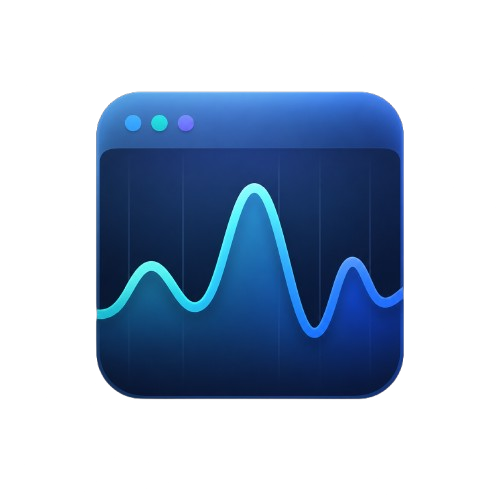

# 📝 NoteMate

A modern, responsive note management application built with React. NoteMate helps users quickly create, manage, and organize short notes with a clean interface and responsive design.



---

## ✨ Features

- 📝 **Create Notes**
  - Quickly add short notes with a simple and intuitive input interface.
  - Supports notes up to 100 characters.

- 📋 **View Notes**
  - Displays notes in a responsive card-based layout.
  - Maintains consistent card sizing for better UI experience.

- 🗑️ **Delete Notes**
  - Remove individual notes when no longer needed.

- 🧹 **Clear All Notes**
  - Remove all saved notes with a single action.

- 📱 **Fully Responsive Design**
  - Optimized for:
    - Desktop
    - Tablet
    - Mobile devices

- 🎨 **Modern UI**
  - Smooth animations
  - Glass-style components
  - Clean card layouts
  - Responsive grid system

---

## 🚀 Demo

Live Demo:

> [Link to application preview](https://note-mate-nine.vercel.app/)

---

## 🛠️ Tech Stack

### Frontend

- React.js
- JavaScript (ES6+)
- CSS3
- React Icons

### Tools

- npm
- Vite & React Development Environment
- Git & GitHub

---

## ⚙️ Installation & Setup

Clone the repository:

```bash
git clone https://github.com/esistdini/NoteMate.git
```

Navigate into the project:

```bash
cd NoteMate
```

Install dependencies:

```bash
npm install
```

Start the development server:

```bash
npm run dev
```

The application will be available at:

```
http://localhost:3000
```

---

## 🎯 Usage

1. Open NoteMate.
2. Enter your note in the input field.
3. Click **Add** to create a note.
4. Manage your notes using:
   - Delete
   - Clear All

---

## 🎨 Design Philosophy

NoteMate focuses on:

- Simplicity
- Accessibility
- Responsive layouts
- Minimal distractions
- Smooth user experience

The interface uses reusable components and a scalable CSS variable-based theme system.

---

## 🔮 Future Improvements

Planned improvements:

- [ Done ] Local storage persistence
- [ ] Search notes
- [ ] Note categories/tags
- [ ] Pin important notes
- [ ] Markdown support
- [ ] User authentication
- [ ] Cloud synchronization
- [ ] Colorful Themes
- [ ] Edit notes

---

## 👨‍💻 Developer

Designed and Developed by:

**Dinesh Aswin S**

Connect with me:

- GitHub: https://github.com/esistdini/
- Instagram: https://instagram.com/dineshaswin.s/
- LinkedIn: https://linkedin.com/in/dinesh-aswin-s/

---

## 📜 License

This project is licensed under the **MIT License**.

You are free to:

- Use
- Modify
- Distribute
- Contribute

See the [LICENSE](./LICENSE) file for more information.

---

⭐ If you find this project useful, consider giving it a star!